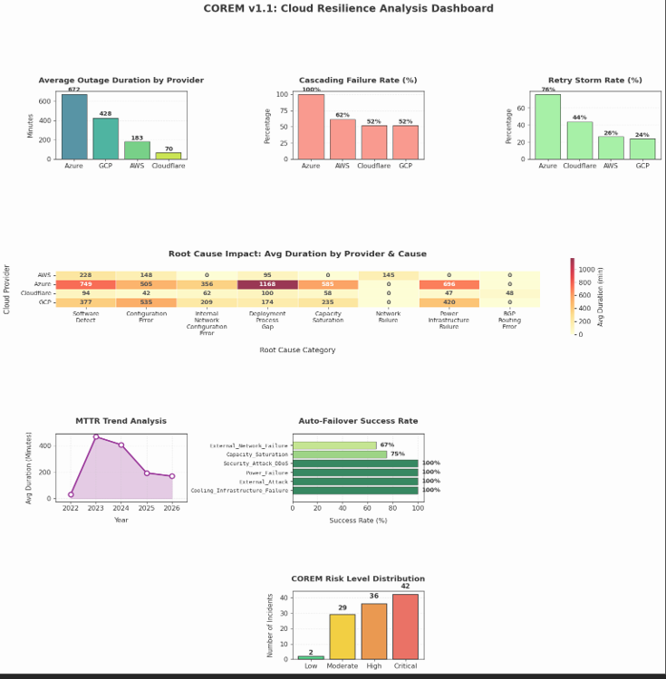

# ☁️ COREM v1.1 – Cloud Outage Resilience Evaluation Framework

COREM (Cloud Outage Resilience Evaluation Framework) is an academic project that analyzes the resilience of major cloud providers using publicly available outage postmortems.

The primary contribution of this project was the collection, normalization, and standardization of real-world cloud outage data from multiple providers into a unified dataset suitable for comparative resilience analysis.

---

## Project Contribution

The core objective of this project was to build a reliable multi-cloud incident dataset rather than simply analyze existing data.

The work involved:

- Collecting public outage postmortems from AWS, Microsoft Azure, Google Cloud Platform, and Cloudflare.
- Studying incident reports from the last several years.
- Extracting outage characteristics from each provider.
- Designing a common schema that could represent incidents across different cloud platforms.
- Cleaning, validating, and normalizing the collected data into a single structured dataset.
- Developing the COREM framework for comparative resilience evaluation.

---

## Framework Features

- Multi-cloud outage dataset
- Cloud incident normalization
- Provider resilience comparison
- Root cause categorization
- COREM risk scoring model
- Statistical analysis
- Interactive visualizations
- Incident evaluation framework

---

## Technologies

- Python
- Pandas
- NumPy
- Matplotlib
- Scikit-learn
- Google Colab

---

## Dataset

The normalized multi-cloud outage dataset used in this project is included in this repository.

📄 **Dataset:** [multi_cloud_incident_dataset.xlsx](./multi_cloud_incident_dataset.csv)

The dataset contains standardized outage incidents collected from publicly available postmortems published by AWS, Microsoft Azure, Google Cloud Platform (GCP), and Cloudflare.

The dataset consists of normalized outage incidents collected from publicly available postmortems published by:

- Amazon Web Services (AWS)
- Microsoft Azure
- Google Cloud Platform (GCP)
- Cloudflare

Each incident was standardized into a common schema including:

- Provider
- Date
- Service
- Root Cause
- Incident Type
- Duration
- Blast Radius
- Severity
- Customer Impact
- Retry Storm
- Cascading Failure
- Auto Failover
- Region

This normalization enables direct comparison of cloud providers despite differences in their original reporting formats.

---

## Dashboard

---

## Publication

This project formed the basis of our research paper:

**"A COREM-Based Framework for Cross-Provider Cloud Outage Analysis and Resilience Evaluation"**

Published in the **International Journal of Innovative Science and Research Technology (IJISRT)**

Volume 11 | Issue 5 | May 2026

📄 Research Paper: (paste paper link)

🏆 Author Certificate: (paste certificate image or PDF)

## Note

The implementation of the COREM analysis framework uses Python for data processing, scoring, and visualization. The primary research contribution of this project lies in the creation of the normalized multi-cloud incident dataset and the design of the evaluation framework.
